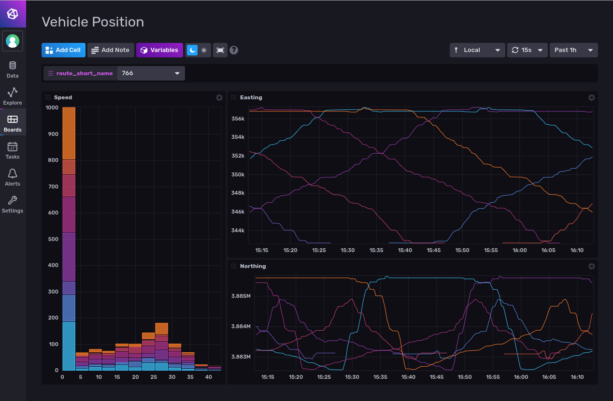

# Albuquerque Bus System Monitoring with InfluxDB 2.0

This repository contains a simple setup to log and monitor ABQ transit data in real-time.



## How to run:

Note: InfluxDB data will be stored in the `influxdb-data` folder by default. Configure this location in `docker-compose.yml`

1. Check the `docker-compose.yml` for path configuration options.
2. Stand-up influxdb:
```
docker-compose up -d influxdb
```
3. Setup InfluxDB with a user, org, and bucket. The telegraf config expects: `org=tauterra`, `bucket=abqtransit`.
4. Create a token with write permissions to the `abqtransit` bucket. Make note of this token.
5. Paste the token in `docker-compose.yml` under `services/telegraf/environment/INFLUX_TOKEN`.
6. Start remaining containers:
```
docker-compose up -d abq_transit_proxy
docker-compose up -d telegraf
```

## Development notes

If you change Python code in `abq_transit_proxy`:
```
docker-compose build abq_transit_proxy && docker-compose up -d --force-recreate abq_transit_proxy
```

If you change the Token:
```
docker-compose up -d --force-recreate telegraf
```
